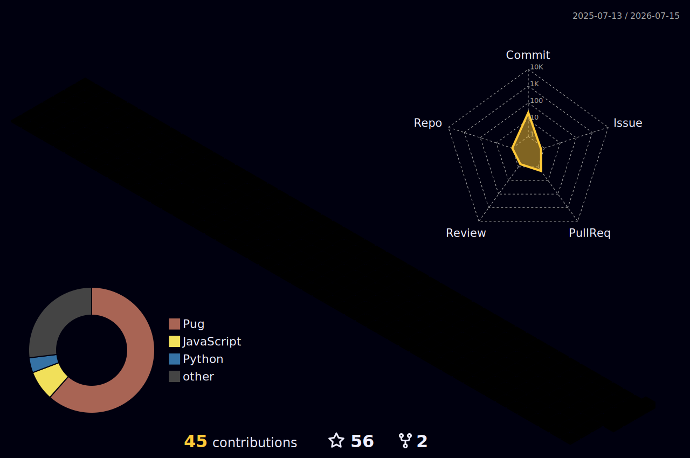

<!--
  GitHub Profile README for Milan Rawat
  Repository name must exactly match your username: milan-rawat/milan-rawat
-->

<div align="center">


<a href="https://readme-typing-svg.demolab.com">
  
</a>

<br/>

<a href="https://milan-rawat.github.io/">
  
</a>
<a href="https://www.linkedin.com/in/milan-rawat">
  
</a>
<a href="mailto:milanrawat086@gmail.com">
  
</a>
<a href="https://github.com/milan-rawat?tab=followers">
  
</a>

<br/><br/>


</div>

---

## 👨‍💻 About Me

<table>
<tr>
<td width="58%" valign="top">

I’m a **Full Stack Developer with 4+ years of experience** building production-grade applications across **Healthcare, EdTech, E-commerce, and Marketplace platforms**.

My work spans frontend engineering, backend architecture, real-time communication, payment systems, AI-powered features, cloud deployment, and third-party integrations.

- 🔭 Building **TrippinBuddy**, a social travel platform
- ⚡ Strong with **React, Next.js, Node.js, Express, MongoDB, PostgreSQL, and TypeScript**
- 🤖 Exploring **Machine Learning, RAG, vector search, and intelligent products**
- 💳 Experienced with **Stripe subscriptions, payments, and webhooks**
- 🔄 Built real-time systems using **Socket.io and WebSockets**
- ☁️ Worked with **AWS, Docker, GitHub Actions, and production deployments**
- 🎯 Interested in impactful **Full Stack, MERN, React, and Node.js roles**

</td>
<td width="42%" valign="top">

```ts
const milan = {
  role: "Full Stack Developer",
  experience: "4+ years",
  currentProject: "TrippinBuddy",
  domains: [
    "Healthcare",
    "EdTech",
    "E-commerce",
    "Marketplaces"
  ],
  strengths: [
    "Full-stack architecture",
    "Real-time systems",
    "Payments",
    "Cloud deployment",
    "AI integrations"
  ],
  mindset: "Build. Learn. Improve."
};
```

</td>
</tr>
</table>

---

## 🎯 What I Bring

<div align="center">

| Product Engineering | Backend & Architecture | Integrations | Reliability |
|:---:|:---:|:---:|:---:|
| Production web apps | REST APIs | Stripe | Monitoring |
| Responsive frontend | Scalable services | OpenAI | Debugging |
| Admin dashboards | Auth & permissions | Jitsi Meet | Webhooks |
| Real-time UX | Data modeling | ShipRocket | Deployment |

</div>

---

## 🧰 Tech Stack

<div align="center">

### Languages


### Frontend


### Backend


### Databases


### Cloud, DevOps & Tools


### AI & Machine Learning


<br/>


</div>

---

## 🚀 Featured Work

<table>
<tr>
<td width="50%" valign="top">

### 🌍 TrippinBuddy

A travel platform designed to help people discover compatible travelers and trusted local guides.

**Core ideas**

- Traveler and guide discovery
- Secure authentication
- Trip creation and planning
- Real-time messaging
- Booking-ready architecture
- Payment and subscription foundations

**Stack**

`React` `TypeScript` `Node.js` `Express` `MongoDB` `Redux` `Socket.io` `Stripe`

</td>
<td width="50%" valign="top">

### 🏥 BeekHealth

A healthcare platform supporting interoperability, laboratory workflows, subscriptions, monitoring, and AI-powered assistance.

**Contributions**

- Epic and Cerner ecosystem connectivity
- OpenAI-powered provider support
- Stripe subscriptions and webhooks
- Lab-order creation and tracking
- LogRocket production monitoring
- Healthcare data-exchange workflows

**Stack**

`React` `Node.js` `Django` `OpenAI` `Stripe` `LogRocket`

</td>
</tr>

<tr>
<td width="50%" valign="top">

### 🧑‍💻 Geeker

A real-time marketplace connecting customers with remote IT technicians.

**Contributions**

- Jitsi Meet session workflows
- Socket.io live notifications
- Technician onboarding
- Availability and status updates
- Stripe billing and webhooks
- Session reliability improvements

**Stack**

`React` `Node.js` `MongoDB` `Socket.io` `Jitsi Meet` `Stripe`

</td>
<td width="50%" valign="top">

### 🎓 Cheetah Learning

An education platform with examination workflows and operational administration.

**Contributions**

- Online examination lifecycle
- Submission and result processing
- Performance tracking
- Django Admin search and filters
- Student, exam, and class management
- Operational workflow improvements

**Stack**

`Django` `Python` `JavaScript` `HTML` `CSS`

</td>
</tr>
</table>

---

## 🏢 Experience Timeline

```text
2022 — 2026   Full Stack Developer · RTE Softwares
               Healthcare, EdTech and real-time marketplace applications

2022          Full Stack Developer · Freelancer
               E-commerce, food delivery, logistics and admin platforms

2021 — 2022   MERN Stack Developer Intern · Applore Technologies
               REST APIs, search systems, AWS media storage and dashboards
```

<details>
<summary><b>📌 View selected engineering contributions</b></summary>
<br/>

- Built and maintained scalable React and Node.js applications across multiple domains.
- Developed REST APIs, service layers, authentication flows, and optimized data models.
- Implemented Stripe billing, subscription management, payment flows, and webhook processing.
- Worked on real-time communication using Socket.io and WebSockets.
- Integrated OpenAI, Jitsi Meet, Firebase, ShipRocket, LogRocket, and healthcare services.
- Created admin dashboards, examination workflows, search systems, and background automation.
- Supported deployments and production operations using AWS, Docker, Git, and GitHub.

</details>

---

## 🏗️ Engineering Map

```text
┌───────────────────────────────────────────────────────────────────┐
│                           PRODUCT LAYER                           │
│     Healthcare  •  EdTech  •  E-commerce  •  Marketplaces       │
├───────────────────────────────────────────────────────────────────┤
│                          FRONTEND LAYER                           │
│     React  •  Next.js  •  Redux  •  Tailwind  •  TypeScript     │
├───────────────────────────────────────────────────────────────────┤
│                           BACKEND LAYER                           │
│        Node.js  •  Express  •  Django  •  REST APIs              │
├───────────────────────────────────────────────────────────────────┤
│                            DATA LAYER                             │
│     MongoDB  •  PostgreSQL  •  MySQL  •  Vector Databases       │
├───────────────────────────────────────────────────────────────────┤
│                         PLATFORM LAYER                            │
│ AWS  •  Docker  •  Stripe  •  Socket.io  •  OpenAI  •  CI/CD   │
└───────────────────────────────────────────────────────────────────┘
```

---

## 📊 GitHub Activity

<div align="center">


<br/><br/>


</div>

> GitHub counts qualifying contributions. Private contribution visibility can be enabled from your GitHub profile settings.

---

## 🌌 3D Contribution Calendar

<div align="center">



</div>

> This image is generated automatically by the included `profile-3d.yml` workflow.

---

## 🐍 Contribution Snake

<div align="center">

<picture>
  <source media="(prefers-color-scheme: dark)" srcset="https://raw.githubusercontent.com/milan-rawat/milan-rawat/output/github-contribution-grid-snake-dark.svg">
  <source media="(prefers-color-scheme: light)" srcset="https://raw.githubusercontent.com/milan-rawat/milan-rawat/output/github-contribution-grid-snake.svg">
  
</picture>

</div>

> Run the included snake workflow once from the Actions tab after pushing the files.

---

## 🧠 Current Learning Path

<div align="center">


</div>

---

## 🎓 Certifications

| Certification | Provider |
|---|---|
| Complete A.I. & Machine Learning, Data Science Bootcamp | Udemy |
| Git & GitHub Bootcamp | Udemy |
| Google Cloud Ready Facilitator | Google Cloud |
| Data Science Orientation | Coursera |
| What Is Data Science? | Coursera |
| React – The Complete Guide | Udemy |
| Node.js, Express, MongoDB & More | Udemy |

---

## 💡 Engineering Principles

```diff
+ Build for users, not only for demos.
+ Prefer readable and maintainable code.
+ Treat monitoring, errors, and edge cases as product features.
+ Keep learning, shipping, measuring, and improving.
- Avoid complexity that does not create value.
- Never stop at "it works on my machine."
```

---

## 🤝 Let’s Build Something Valuable

<div align="center">

<a href="https://milan-rawat.github.io/">
  
</a>
<a href="https://www.linkedin.com/in/milan-rawat">
  
</a>
<a href="mailto:milanrawat086@gmail.com">
  
</a>
<a href="https://github.com/milan-rawat">
  
</a>

<br/><br/>

### “Great products are built where clean engineering meets real user needs.”


</div>
